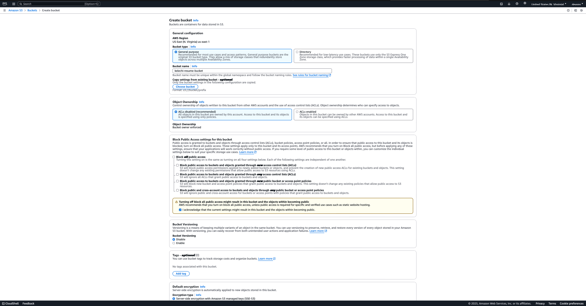
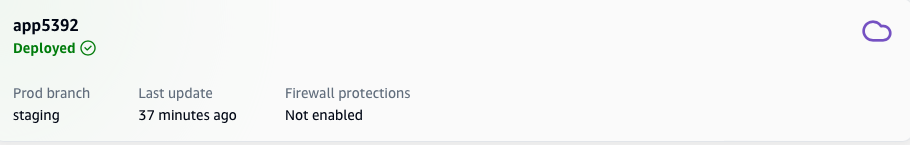

#  Kelechi Emmanuel Anyanwu - Resume Website

Welcome to the repository for my **personal resume website**! This is a static website hosted on **Amazon S3** and deployed using **AWS Amplify**. The website showcases my skills, education, experience, and projects, serving as a professional portfolio to highlight my background.

## Live Website
You can view the live website here: [Kelechi Emmanuel Anyanwu - Resume](https://staging.d7kqtiblphwzo.amplifyapp.com/)

## Features
- **Static Website**: Built using HTML, CSS, and JavaScript for fast and responsive performance.
- **Professional Design**: Clean and modern layout with easy navigation.
- **AWS Hosting**: Hosted on Amazon S3 for secure, scalable, and cost-effective storage.
- **Continuous Deployment**: Managed through AWS Amplify for seamless updates.
- **Mobile-Friendly**: Fully responsive design for optimal viewing on all devices.

## Contents
- **Personal Information**: Contact details and a summary of my background.
- **Skills**: Highlights of my technical and soft skills.
- **Education**: Academic achievements and relevant coursework.
- **Experience**: Volunteer and professional roles showcasing my contributions.
- **Projects**: Practical applications of my skills, including AWS and Vagrant automation.
- **Certifications**: Verified credentials showcasing expertise.

## Purpose
This project demonstrates my journey toward becoming a **DevOps Engineer** and highlights my **AWS proficiency** in technologies like S3 and Amplify. It reflects my ability to create and manage scalable solutions while building my personal brand.

## Process
### Hosting on Amazon S3
1. Created an S3 bucket and configured it for static website hosting.
2. Uploaded all website files, including HTML, CSS, and JavaScript.
3. Configured bucket policies to allow public read access for the website content.
4. Tested the website using the S3 bucket endpoint.

## Deploying with AWS Amplify

### Amplify Console Setup
1. Logged into the **AWS Amplify Console** and started the setup for a new Amplify app.
2. Connected the Amplify app to the **GitHub repository** containing the website's source code.

### Integration with Amazon S3
3. Linked the Amplify project to the previously created **S3 bucket** to enable storage and retrieval of static website content.
4. Configured Amplify to use the S3 bucket as the primary storage for the website files during the build and deployment process.

# Kelechi Emmanuel Anyanwu - Resume

This repository documents the process of creating and hosting my **personal resume website** using **AWS Amplify** and **Amazon S3**.

## Live Website
You can view the live website here: [Kelechi Emmanuel Anyanwu - Resume](https://staging.d7kqtiblphwzo.amplifyapp.com/)

---

## Deployment Process with Screenshots

### Step 1: Creating an S3 Bucket
I started by creating an **Amazon S3 bucket** to store the static files for my website.

---

### Step 2: Uploading Files to S3
Uploaded the HTML, CSS, and JavaScript files to the S3 bucket.

---

### Step 3: Setting Up AWS Amplify
using my already made s3 bucket with all the files needed there.

---
### Step 4: choosing s3 bucket 

---

### Step 5: Selecting the s3 locaation of object to host

---

### Step 6: status of S3 deployed static website

### Step 7: Testing the Live Site
Tested the website using the Amplify-provided domain to ensure everything was working as expected.

